# 圖片儲存架構圖集

**用途**: 視覺化系統架構與決策流程
**格式**: Mermaid Diagrams (可在 GitHub/GitLab/Notion 直接渲染)
**更新日期**: 2026-01-29

---

## 1. 現狀架構圖 (Current Architecture)

```mermaid
graph TB
    subgraph "Frontend Layer"
        A1[UploadZone<br/>文件上傳]
        A2[ImageGenerationDialog<br/>AI 圖片生成]
        A3[OnlyOfficeEditor<br/>文件編輯器]
        A4[TemplateDesigner<br/>模板設計]
    end

    subgraph "API Layer"
        B1[/api/sources/create]
        B2[/api/projects/images/generate]
        B3[/api/onlyoffice-callback]
        B4[/api/templates/parse]
    end

    subgraph "Storage Layer - Supabase"
        C1[(raw-files Bucket)]
        C2[Cloudflare CDN<br/>275+ 節點]
        C3[(PostgreSQL)]
    end

    subgraph "Database Tables"
        D1[sources<br/>origin_url]
        D2[task_images<br/>image_url]
        D3[templates<br/>parsed_images]
    end

    A1 --> B1
    A2 --> B2
    A3 --> B3
    A4 --> B4

    B1 --> C1
    B2 --> C1
    B3 --> C1
    B4 --> C1

    C1 --> C2
    C1 --> C3

    C3 --> D1
    C3 --> D2
    C3 --> D3

    style C1 fill:#4CAF50,color:#fff
    style C2 fill:#2196F3,color:#fff
    style C3 fill:#4CAF50,color:#fff
```

---

## 2. 優化後架構圖 (Optimized Architecture)

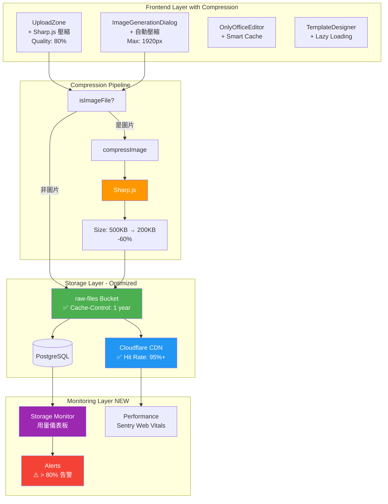

---

## 3. 方案對比流程圖 (Solution Comparison)

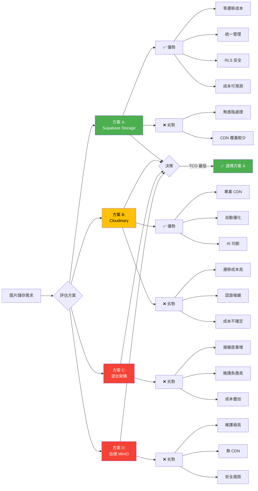

---

## 4. 決策流程圖 (Decision Flow)

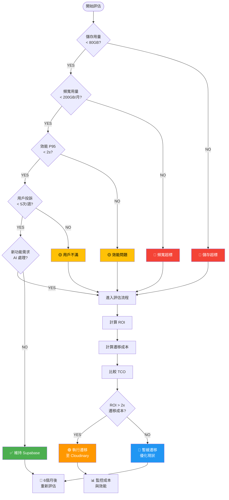

---

## 5. 成本趨勢圖 (Cost Trend)

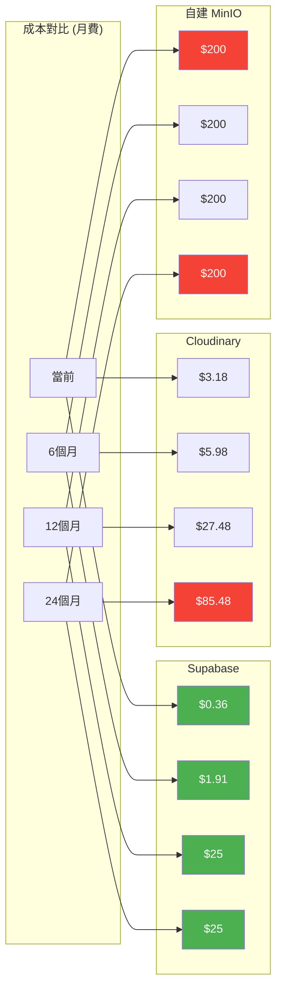

---

## 6. 資料流圖 (Data Flow)

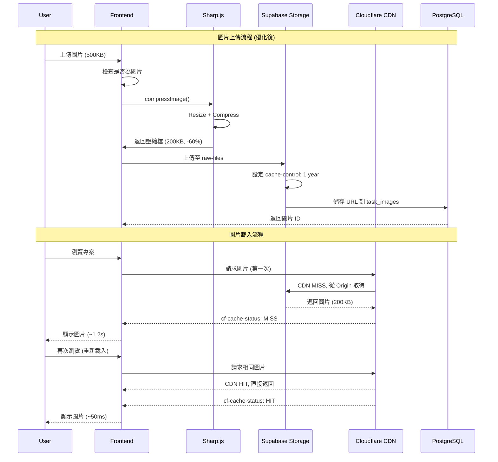

---

## 7. 部署架構圖 (Deployment Architecture)

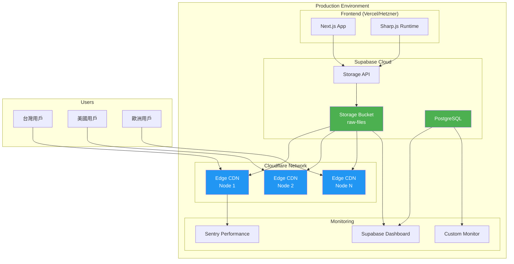

---

## 8. 遷移策略圖 (Migration Strategy - IF NEEDED)

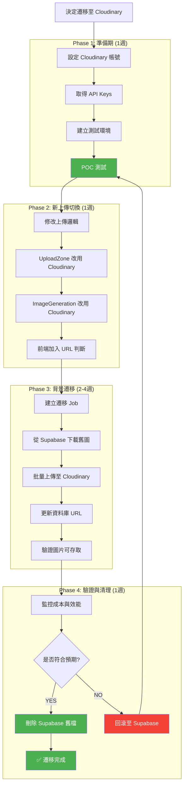

---

## 9. 用量成長預測圖 (Usage Growth Projection)

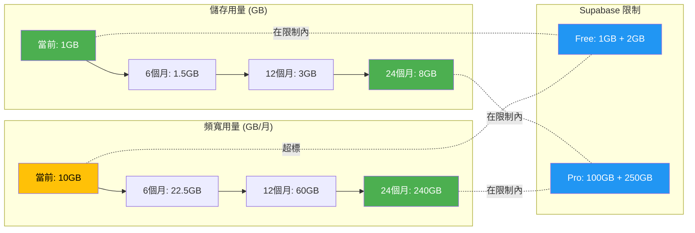

---

## 10. 監控架構圖 (Monitoring Architecture)

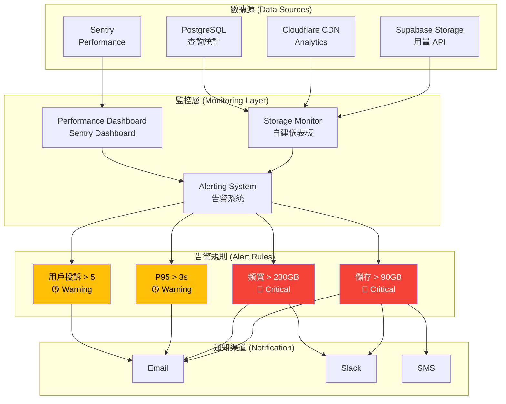

---

## 11. 架構演進路線圖 (Architecture Roadmap)

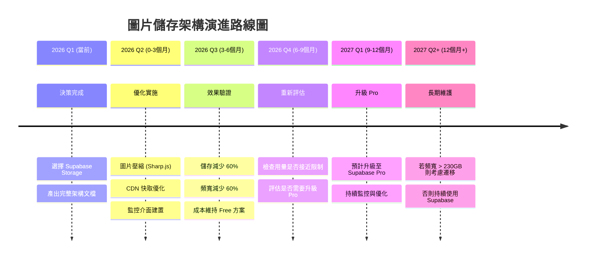

---

## 12. 技術債務管理圖 (Technical Debt Management)

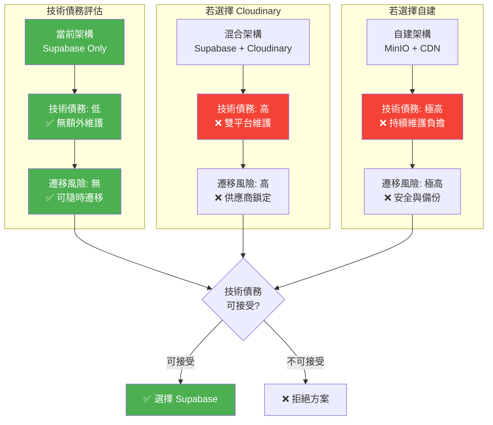

---

## 如何使用這些圖表

### 在 Markdown 文件中渲染
這些 Mermaid 圖表可以在以下平台直接渲染：
- ✅ GitHub (原生支援)
- ✅ GitLab (原生支援)
- ✅ Notion (需安裝 Mermaid 插件)
- ✅ VS Code (需安裝 Mermaid 擴充套件)
- ✅ Obsidian (原生支援)

### 匯出為圖片
使用 Mermaid CLI:
```bash
# 安裝 Mermaid CLI
npm install -g @mermaid-js/mermaid-cli

# 匯出為 PNG
mmdc -i image-storage-architecture-diagrams.md -o architecture-diagram.png

# 匯出為 SVG
mmdc -i image-storage-architecture-diagrams.md -o architecture-diagram.svg
```

### 線上編輯器
- [Mermaid Live Editor](https://mermaid.live/)
- 複製圖表程式碼 → 貼上編輯器 → 匯出圖片

---

**維護者**: Leo (系統架構師)
**更新日期**: 2026-01-29
**版本**: 1.0
**相關文檔**: ADR-001, 實施指南, 決策矩陣
