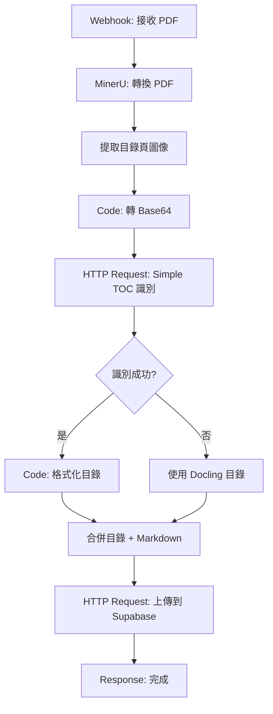

# 簡易目錄識別服務整合指南

本文檔說明如何將簡易目錄識別服務（Simple TOC Service）整合到現有的 RFP 自動化系統中。

## 概述

Simple TOC Service 提供：
- ✅ PDF 目錄頁圖像識別
- ✅ 結構化目錄提取（層級、標題、頁碼）
- ✅ 完全本地部署（無需外部 API）
- ✅ RESTful API 接口
- ✅ 使用 Tesseract OCR（輕量級）

## 服務對比

| 服務 | 用途 | 優勢 | 缺點 |
|------|------|--------|------|
| **Simple TOC Service** | 目錄頁識別（Tesseract OCR） | • 完全免費<br>• 輕量級（<500MB）<br>• 快速部署<br>• 零維護成本 | • OCR 準確度依賴圖片品質<br>• 需要匹配目錄格式 |
| **GLM-4.7 Vision** | 目錄頁視覺識別 | • API 調用簡單<br>• 性能優越 | • 需要 API Key<br>• 有費用<br>• 依賴外部服務 |
| **Docling** | PDF 文本解析 | • 速度快<br>• 支持多種格式 | • 目錄識別不準確 |

**推薦策略：**
- **開發環境**：使用 Simple TOC Service（快速、免費）
- **生產環境**：使用 Simple TOC Service（零成本、完全控制）
- **高準確度需求**：使用 GLM-4.7 Vision（備選方案）

## 技術實現

### 識別規則

服務使用規則匹配來識別目錄結構：

1. **主章節**: 中文數字（壹、貳、參...）或數字（一、二、三...）
2. **子章節**: 數字編號（1.1、1.2、2.1...）
3. **次級章節**: 括號編號（(1)、(2)、(3)...）

### 目錄判斷

- 至少檢測到 2 個主章節條目
- 支援頁碼信息提取

## 整合到 n8n 工作流

### 工作流架構



## n8n 工作流配置

### 節點 1：Webhook 節點

```json
{
  "method": "POST",
  "path": "parse-rfp-toc",
  "responseMode": "responseNode",
  "options": {}
}
```

### 節點 2：MinerU 轉換（HTTP Request）

```json
{
  "method": "POST",
  "url": "http://mineru-service:8000/convert",
  "sendBody": true,
  "contentType": "json",
  "bodyParameters": {
    "parameters": [
      {
        "name": "pdf_url",
        "value": "={{ $json.pdfUrl }}"
      }
    ]
  }
}
```

### 節點 3：提取目錄頁圖像（Code 節點）

```javascript
// 假設 MinerU 返回圖片路徑
const mineruOutput = $input.all();
const tocPageIndex = mineruOutput[0].json.tocPageIndex || 1; // 預設第 2 頁

return {
  tocPageIndex: tocPageIndex,
  images: mineruOutput[0].json.images || []
};
```

### 節點 4：讀取並轉 Base64（Code 節點）

```javascript
const fs = require('fs');
const path = require('path');

// 讀取目錄頁圖片
const tocImage = $json.images[$json.tocPageIndex];
const imagePath = tocImage.path;
const imageBuffer = fs.readFileSync(imagePath);
const base64Image = `data:${tocImage.mimeType};base64,${imageBuffer.toString('base64')}`;

return {
  base64Image: base64Image,
  tocPageIndex: $json.tocPageIndex
};
```

### 節點 5：Simple TOC 識別（HTTP Request）

```json
{
  "method": "POST",
  "url": "http://llava-next-service:8001/recognize-toc",
  "sendBody": true,
  "contentType": "json",
  "bodyParameters": {
    "parameters": [
      {
        "name": "image",
        "value": "={{ $json.base64Image }}"
      }
    ]
  },
  "options": {
    "timeout": 30000
  }
}
```

### 節點 6：檢查識別結果（IF 節點）

```json
{
  "conditions": {
    "string": [
      {
        "value1": "={{ $json.is_toc_page }}",
        "value2": "true",
        "operation": "equals"
      }
    ]
  }
}
```

### 節點 7：格式化目錄（Code 節點 - IF 分支）

```javascript
const tocData = $input.all();
const tocEntries = tocData[0].json.entries || [];

// 構建結構化目錄
let structuredTOC = {
  type: "structured",
  entries: tocEntries.map(entry => ({
    level: entry.level,
    title: entry.title,
    page_number: entry.page_number,
    indentation: entry.indentation
  }))
};

// 同時生成 Markdown
let tocMarkdown = '## 目錄\n\n';
tocEntries.forEach(entry => {
  const indent = '  '.repeat(entry.indentation || 0);
  const prefix = {
    1: '#',
    2: '##',
    3: '###'
  }[entry.level] || '####';
  
  tocMarkdown += `${indent}${prefix} ${entry.title}`;
  
  if (entry.page_number) {
    tocMarkdown += ` (頁 ${entry.page_number})`;
  }
  
  tocMarkdown += '\n\n';
});

return {
  structuredTOC: structuredTOC,
  tocMarkdown: tocMarkdown,
  tocSuccess: true
};
```

### 節點 8：使用 Docling 目錄（Code 節點 - ELSE 分支）

```javascript
// 當 Simple TOC 識別失敗時，回退使用 Docling 的目錄
const doclingOutput = $('MinerU 轉換').item.json;

return {
  structuredTOC: {
    type: "docling",
    entries: doclingOutput.toc || []
  },
  tocMarkdown: doclingOutput.tocMarkdown || '',
  tocSuccess: false
};
```

### 節點 9：合併目錄 + Markdown（Code 節點）

```javascript
const doclingMarkdown = $('MinerU 轉換').item.json.markdown;
const tocData = $input.all()[0].json;

// 在 Markdown 前面插入目錄
const finalMarkdown = tocData.tocMarkdown + '\n---\n\n' + doclingMarkdown;

return {
  markdown: finalMarkdown,
  toc: tocData.structuredTOC,
  tocSuccess: tocData.tocSuccess,
  metadata: {
    tocSource: tocData.tocSuccess ? 'simple-toc-service' : 'docling-fallback'
  }
};
```

### 節點 10：上傳到 Supabase（HTTP Request）

```json
{
  "method": "POST",
  "url": "{{ $env.SUPABASE_URL }}/rest/v1/projects",
  "authentication": "genericCredentialType",
  "genericAuthType": "httpHeaderAuth",
  "sendBody": true,
  "contentType": "json",
  "bodyParameters": {
    "parameters": [
      {
        "name": "markdown_content",
        "value": "={{ $json.markdown }}"
      },
      {
        "name": "toc_data",
        "value": "={{ JSON.stringify($json.toc) }}"
      },
      {
        "name": "toc_success",
        "value": "={{ $json.tocSuccess }}"
      },
      {
        "name": "status",
        "value": "completed"
      }
    ]
  }
}
```

## Docker Compose 整合

在主專案的 `docker-compose.yml` 中添加 Simple TOC Service：

```yaml
version: '3.8'

services:
  # 現有服務...
  n8n:
    # ...
  
  mineru-service:
    # ...
  
  # 新增 Simple TOC Service
  llava-next-service:
    build: ./llava-next-service
    container_name: llava-next-service
    ports:
      - "8001:8000"
    volumes:
      - ./llava-next-service/output:/app/output
    environment:
      - PYTHONUNBUFFERED=1
    restart: unless-stopped
    deploy:
      resources:
        limits:
          cpus: '2'
          memory: 2G
        reservations:
          cpus: '1'
          memory: 1G
    healthcheck:
      test: ["CMD", "curl", "-f", "http://localhost:8000/health"]
      interval: 30s
      timeout: 10s
      retries: 3
      start_period: 10s
    networks:
      - app-network

networks:
  app-network:
    external: true
```

## 性能優化

### 1. 圖片預處理

在服務端已實現以下優化：
- 自動調整圖片大小（最大 2048x2048）
- 轉換為灰度以提高 OCR 準確度
- 縮小圖片以加速處理

### 2. 批次處理

對於大量 PDF，可以實現批次處理：

```javascript
// n8n Code 節點 - 批次處理
const images = $json.images;
const tocIndices = detectTOCPages(images); // 自動檢測目錄頁

return tocIndices.map(index => ({
  json: {
    index: index,
    imagePath: images[index].path
  }
}));
```

### 3. 快取

雖然當前服務未實現快取，但可以在 n8n 中實現：

```javascript
// 使用 n8n 數據庫或外部 Redis 快取
const cacheKey = `toc:${md5(imageData)}`;
const cached = getFromCache(cacheKey);

if (cached) {
  return cached;
}

const result = await callTOCService(imageData);
saveToCache(cacheKey, result);
return result;
```

## 監控和日誌

### 查看服務日誌

```bash
# 即時日誌
docker logs -f llava-next-service

# 最近 100 行
docker logs --tail 100 llava-next-service
```

### 健康檢查

```bash
# 定期健康檢查
curl http://localhost:8001/health
```

### 監控指標

可以整合到現有的監控系統：
- 請求成功率（目標：>95%）
- 平均響應時間（目標：<5 秒）
- 識別準確率（目標：>80%）

## 故障排除

### 問題 1：識別結果不準確

**症狀**：
- `is_toc_page: false`
- 目錄條目缺失或錯誤

**解決方案**：
1. 檢查 PDF 目錄格式是否符合規則
2. 提高輸入圖片解析度
3. 調整識別規則（修改 `service.py`）
4. 考慮使用 GLM-4.7 Vision 作為備選

### 問題 2：API 超時

**症狀**：
```
Error: Request timeout after 30000ms
```

**解決方案**：
1. 增加 HTTP Request 的超時設定（例如：60000ms）
2. 減少圖片大小
3. 檢查服務資源使用情況

### 問題 3：中文識別效果差

**症狀**：
- 中文標題識別錯誤
- 亂碼

**解決方案**：
1. 確保 Docker 映像包含中文語言包
2. 調整 Tesseract 配置（`TESSERACT_CONFIG`）
3. 使用更高解析度的圖片

## 成本分析

### Simple TOC Service（本地部署）

| 項目 | 成本 |
|------|------|
| 映像大小 | <500MB |
| 首次啟動 | ~2 分鐘 |
| 推理 | 免費（本地 CPU） |
| 維護 | 極低（開源工具） |

### GLM-4.7 Vision（API）

| 項目 | 成本 |
|------|------|
| API 調用 | ¥0.01/1K tokens |
| 1000 個 PDF 目錄 | 約 ¥10-50 |
| 維護 | 零（官方支持） |

**結論**：
- 長期使用：Simple TOC Service 更便宜（零成本）
- 快速開發：Simple TOC Service 也很快捷
- 高準確度需求：可考慮 GLM-4.7 Vision

## 使用案例

### 案例 1：標準政府標書目錄

目錄格式：
```
壹、專案背景
貳、技術方案
參、實施計畫
```

處理流程：
1. MinerU 提取目錄頁圖像
2. Simple TOC 識別中文數字編號
3. 自動提取標題和頁碼

### 案例 2：技術文檔目錄

目錄格式：
```
1. 系統架設計
1.1 硬體配置
1.2 軟體架構
```

處理流程：
1. 識別數字編號（1.1、1.2）
2. 分配正確的層級
3. 提取完整的目錄結構

## 進階配置

### 添加自定義識別規則

如果需要支援其他目錄格式，編輯 `service.py`：

```python
# 在 parse_toc_from_text 函數中添加新模式
custom_pattern = r'你的自定義模式\s*(.+?)(?:\.{3,}\s*(\d+))?'

match = re.match(custom_pattern, line)
if match:
    # 處理匹配結果
    entries.append({
        'level': 1,
        'title': match.group(1).strip(),
        'page_number': int(match.group(2)) if match.group(2) else None,
        'indentation': 0
    })
```

### 改善 OCR 準確度

1. **圖片預處理**：添加對比度調整、二值化
2. **自定義 Tesseract 模型**：訓練專用於目錄的字體
3. **使用其他 OCR 引擎**：如 PaddleOCR（中文效果更好）

## 下一步

1. ✅ 啟動服務
   ```bash
   cd llava-next-service
   ./start.sh
   ```

2. ✅ 測試服務
   ```bash
   python test_service.py
   ```

3. ✅ 整合到 n8n 工作流
   - 複製上述 n8n 節點配置
   - 測試完整流程

4. ✅ 部署到生產環境
   - 修改 Docker Compose 配置
   - 設定監控和日誌
   - 執行壓力測試

5. ✅ 優化和迭代
   - 根據實際結果調整識別規則
   - 添加更多目錄格式支援
   - 監控並優化性能

## 相關文檔

- [README.md](README.md) - 服務功能詳解
- [QUICKSTART.md](QUICKSTART.md) - 快速開始指南
- [API 文檔](http://localhost:8001/docs) - Swagger UI
