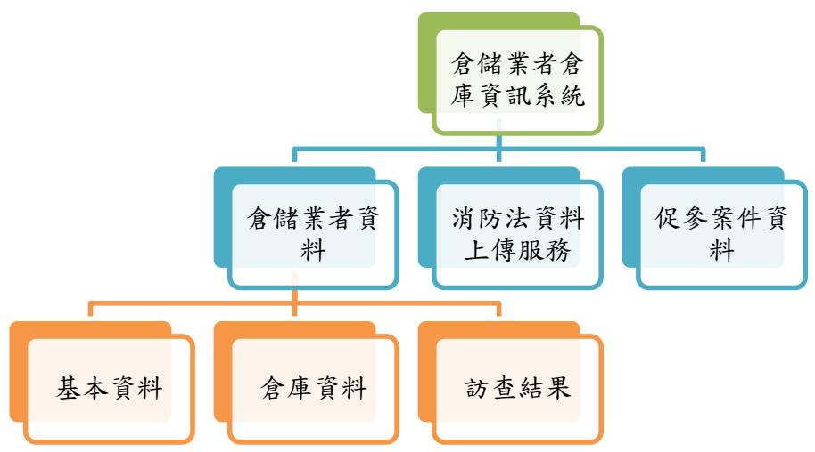
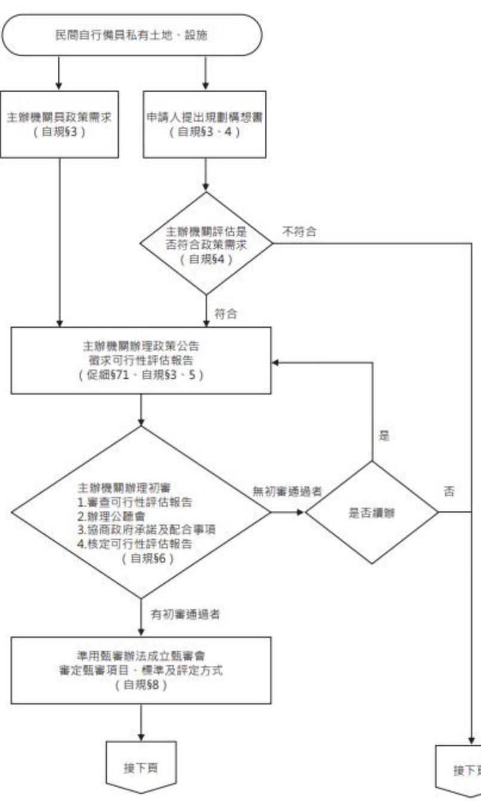

# 經濟部商業發展署倉儲業者倉庫資訊系統建置與維運計畫

# 建議書徵求文件

# 中華民國 114 年 11 月

# 目 錄

# 壹、計畫概述 .......

一、 緣起 .......  
二、計畫名稱. . 2  
三、計畫目標. . 2  
四、 計畫時程.. . 3  
五、 計畫經費.. . 3

# 貳、現況及問題說明.... 4

一、倉儲業安全管理風險升溫與法規遵循缺口. 4  
二、機房及軟硬體設備環境..... 4

# 參、需求規格說明...... 6

一、 投標廠商經驗與能力需求.. . 6  
二、人力需求..... . 6  
(一) 計畫主持人. . 6  
(二) 專案經理.. . 6  
(三) 計畫成員... 7  
(四) 備援人力. 7

# 三、工作需求. 8

(一) 倉儲業者倉庫資訊系統建置.. . 8  
(二) 系統維運工作.... 11  
(三) 本署其他臨時交辦事項.... 12

四、 服務水準需求.. 12

# 五、專案管理需求... 12

(一) 品質保證需求.. 12  
(二) 分包管理需求.. 12  
(三) 驗證與確認需求.. 13  
(四) 開發技術與方法需求.. 13  
(五) 建構管理需求... 14  
(一) 安全政策.... 15  
(二) 系統開發之安全... . 17  
(三) 系統品質及測試之安全.. . 19  
七、保固與移轉需求..... .. 20  
(一) 保固範圍.. . 20  
(二) 保固期間與規定.. . 20  
(三) 移轉規定.... . 21  
八、其他重要需求事項.. . 21  
(一) 政策與規範需求.. . 21  
(二) 其他重要需求. . 21  
九、 保密責任.... . 22

# 肆、交付項目與時程. .. 24

# 伍、投標廠商撰擬建議書相關事宜... .. 25

一、研擬建議書事宜.... . 25  
二、 建議書內容.. . 25  
三、建議書裝訂..... .. 28  
四、 建議書提出事宜. .. 28

# 陸、附錄 ........ .29

一、資訊服務費用估算. .. 29  
二、資通系統防護基準. .. 30

# 壹、計畫概述

# 一、緣起

物流業在現代經濟中扮演著至關重要的角色，為串聯製造業、批發業與零售業等各行業間之後勤支援橋樑。隨著網際網路的快速發展以及行動裝置性能的提升與普及，大幅提高了電子商務的使用性和便利性；加之 COVID-19 疫情加速了傳統商業流通模式的轉變，消費者對網路購物的需求急劇增長，使網路購物已成為當今主流消費方式之一，為滿足配送需求，物流服務重要性與需求量也因而持續強勁成長，成為支撐現代商業運作之關鍵動能。

為能配置與管理大量貨品，越來越多物流業者使用大型倉儲空間存放物品，由於倉儲內部物品眾多且密集，一旦發生火災，其延燒速度將會十分迅速，極易造成重大損失。近年來，多起重大倉儲火災事件凸顯了此一風險，例如 111 年桃園家樂福與美福貿易的倉儲場域火災、112年屏東明揚國際工廠與 113 年高雄海霸王工廠的倉庫大火，這些事件不僅導致財產損失，亦造成嚴重人命傷亡，因此各界對於倉儲安全管理愈發重視。

然而，目前現行各類營利事業登記資料僅能取得公司名稱、營業項目、工廠資料等資訊，並未涵蓋業者之倉儲場所資訊，不利於各主管機關能即時得知倉儲場所和營利事業之確切聯結，此外，113年消防法修法要求儲存化學品之倉庫或儲存場所及一定規模以上之倉庫火災時，管理權人應依中央各主管機關之規定，上傳提供場所平面配置圖、該場所化學品之種類、數量、位置平面配置圖及搶救必要資訊。

另本署亦與民間業者合作大型物流中心 BOO（Build–Own–Operate）之促進民間參與公共建設案件(下稱促參案)，此類大型物流中心具有高度集中與高載貨量等規模性特徵，一旦發生災害，其衝擊程度與外溢風險更為顯著，亦需強化自籌建、申辦、審查至營運階段之安全治理。

綜上，爰本署規劃建置倉儲業者倉庫資訊系統，以蒐集與整合倉儲業者及其倉庫資訊，藉此建立倉儲場域與營利事業之聯結，協助各主管機關有效執行管理與安全監督作為，並作為業者履行法定義務之資料上傳平臺，以及本署管理促參案之資訊平臺，以提升公共建設之整體風險控管與治理效能。

# 二、計畫名稱

倉儲業者倉庫資訊系統建置與維運計畫（以下簡稱本計畫）。

# 三、計畫目標

(一)蒐集、整理倉儲業者之倉庫位置及存放物品資訊，俾利隨時掌握相關資訊，便於各主管機關能即時獲取完整資訊，精準掌握企業實際營運據點，並據以進行聯合查核、防火稽查或其他管理作為，提升倉儲業者營運空間之安全管理水準。

(二)作為倉儲業者履行消防法第 21 條之 1 義務之網路平臺，提供儲存化學品或一定規模以上倉庫的管理權人上傳並更新其場所平面配置圖、化學品種類、數量、位置圖等搶救必要資訊，確保消防及相關搶救單位在災害發生時，能即時取得關鍵且最新的危害資訊，從而大幅強化救災安全與效率。

(三)建置大型物流中心促參案之申辦與履約管理資訊平台，於申辦、審查及履約階段，提供主管機關查詢並連結申請業者既有或規劃之倉儲據點、規模與安全管理相關資料，並於後續營運期間，持續彙整倉儲安全資訊與稽查紀錄，作為物流公共建設規劃與政策調整之決策支援基礎。

# 四、計畫時程

本案實施自決標日起至 115 年12 月31 日止。

# 五、計畫經費

預估經費為新臺幣 420 萬元整【含稅】。

# 貳、現況及問題說明

# 一、倉儲業安全管理風險升溫與法規遵循缺口

隨著電子商務的蓬勃發展，物流業對大型倉儲空間的需求與日俱增。然而，倉儲內部貨品密集且量大，一旦發生火災，極易造成重大傷亡及財產損失，如近年多起倉儲火災事件（例如屏東明揚、高雄海霸王等）所揭示。因此，強化倉儲場所的安全管理已是刻不容緩的社會議題。為有效執行安全監督，各主管機關迫切需要一個系統性的工具，以應對物流快速發展所帶來的巨大安全風險。

當前，現行的營利事業登記資料缺乏業者的倉儲場所確切地址與關鍵資訊，導致主管機關難以即時建立「營利事業」與「倉儲場域」的準確連結，無法有效實施管理。此外，113 年消防法修法已強制要求儲存化學品或一定規模以上的倉庫業者，必須上傳場所平面配置圖與化學品資訊等搶救必要資料。

因此，本署規劃建置倉儲業者倉庫資訊系統，以蒐集、整合這些關鍵資訊，並作為業者履行新法定義務的統一資料上傳平臺，從而協助各機關落實法規要求並提升救災應變能力。

# 二、機房及軟硬體設備環境

本案規劃採用本署已租用之國光機房(GSN)，遠端連線作業將依據行政院加強遠端存取控制機制之要求，採取「原則禁止、例外允許」方式，若有遠端連線需求，須依本署遠端管理規定申請，並使用加密動態連線機制，或廠商可自行規劃採用雲端服務。

# (一)本署可提供之虛擬主機環境規格如下：

1、 伺服器主機：Rocky Linux 8 作業系統/Windows 2019，vCore：2\~8Core，記憶體： $8 { \sim } 3 2 \mathrm { G }$ ，硬碟：200G

2、 資料庫主機：Rocky Linux 8 作業系統/Windows 2019，vCore：2\~4Core，記憶體：8\~32G，硬碟：200G，DB：Oracle Database18c

(二)廠商如對環境有不同需求，可列入建議事項。

(三)廠商須提供有授權之資料庫管理軟體，並經本署同意後使用。

# 參、需求規格說明

# 一、投標廠商經驗與能力需求

(一)投標廠商具資料彙報系統、案件管理系統相關經驗或實績者尤佳。(二)投標廠商若提出相關品質保證或資訊安全等資格證照，如 ISO 27001認證，為加分項目。

# 二、人力需求

投標廠商應組織工作團隊(含分包廠商人力)，負責本計畫相關工作之執行，其成員包含計畫主持人、專案經理、計畫成員、備援人力等，團隊成員須具有資訊規劃、系統分析、系統開發、專案管理、品質控管等專業技能，並於建議書中提出未來工作團隊之人力說明，其人力說明應包含學歷、經歷、資訊專長及相關資訊專業資格能力認證文件(含佐證資料及中英文姓名對照)等，得標後成立之工作團隊名單須經本署審查同意，變更時亦同。

# (一)計畫主持人

計畫主持人應至少具備大專(含)以上之學歷，及 10 年(含)以上資訊工作經驗，並具有 5 年(含)以上實際領導政府資訊系統專案管理經驗之資深人員任之，於本計畫執行期間須依本署之要求，並視需要配合進行協商、說明、報告、簡報、工作會議等事項。

# (二)專案經理

專案經理須為得標廠商正式編制人員，且不得與計畫主持人為同一人，負責專（標）案個案之進度掌控及追蹤，含投標前的前置作業、得標後的建置及驗收進度、以及相關的協調工作。

專案經理於計畫執行期間需依本署之要求執行計畫，並視需要配合進行協商、說明、報告、簡報、及工作會議等事項。本計畫執行期間，計畫主持人、專案經理須定期配合本署召開工作檢討會議，以協調各建置工作所需之資源及相關配合事宜，監控、管理計畫的進度、品質、及風險，並定期向本署彙報各工作小組之作業進度。

專案經理非因離職，不得任意更動；如有人員異動，應於 1 個月前函知本署，並檢附接替人員的相關經歷證明文件，具備相當職級（務），經本署書面審核同意後更換。

# (三)計畫成員

廠商應依據本計畫各項工作項目需求，提出適合條件之人力名單。計畫成員應為主標商或分包廠商之正職人員，相關角色建議包含資訊系統分析及設計師、軟體開發及程式設計師、資訊管理及維護技術人員、網頁設計專長人員、系統整合人員、系統測試專長人員、資料庫專長人員、網路專業人員等。

# (四)備援人力

若工作進度落後，本署有權要求增加工作人員完成以本計畫之工作。

# 三、工作需求

# (一)倉儲業者倉庫資訊系統建置

本計畫主要工作需求為建立資訊系統，該系統分為三項子項系統，以下針對每個部分的具體工作需求進行詳細說明。

  
圖1、系統架構概略

# 1、倉儲業者資料

(1)使用人員與權限：由經濟部商業發展署與地方政府有資料編輯與查閱權限，經濟部商業發展署並有使用者管理權限。

(2)資料欄位

本系統所稱之倉儲業者將定義為稅籍登記之四項營利事業項目中，其中一項有普通倉儲經營或冷藏倉儲經營之業者，系統中預計輸之各業者資料包括其基本資料、以及其所屬倉庫資料和本署 114 年倉儲業者訪查結果資料，且每一項倉庫資料與訪查結果資料需可對應至特定業者，各該資料應有資料欄位說明如下，並設置包含但不限於查詢功能、匯出等相關功能：

A. 基本資料：統一編號、名稱、登記地址、負責人姓名、資本額、是否有倉庫、倉庫數量。  
B. 倉庫資料：編號、樓地板面積、地址、聯絡人姓名與電話及電子郵件、有無公共危險物品、是否儲放鋰電池或含鋰電池之商品、主要儲放物品。  
C. 訪查結果：113 年稅籍登記中營利項目第一項為普通倉儲經營或冷藏倉儲經營之業者計有 1,104 家，為了解該倉儲業者倉儲場域安全性，經濟部商業發展署於 114 年偕同地方政府訪查尚未受稽查或列管之倉儲業者，因此該系統亦規劃將訪查結果納入，相關登載事項包括訪查日期、訪查地點、訪查結果(包括是否有缺失事項以及缺失事項)與後續處置情形，除 114 年訪查結果，亦需有後續年度訪查情形之頁面(欄位與 114 年度訪查結果相同)供地方政府填列爾後辦理訪查結果資料。

# 2、消防法資料上傳服務

消防法第 21 條之 1 規定，消防指揮人員搶救工廠、儲存化學品之倉庫或儲存場所及一定規模以上之實驗室或倉庫火災時，其管理權人應提供場所平面配置圖、該場所化學品之種類、數量、位置平面配置圖及搶救必要資訊，該等必要資訊應依中央各主管機關之規定更新上傳至指定之網路平臺。

倉儲業目前雖非屬應經許可業務，並無法律明訂中央主管機關，惟依現行中央政府機關運作機制，經濟部商業發展署係一般倉儲業與冷凍冷藏倉儲業之產業中央主管機關，故為利倉儲業者於救災時上傳該等資料，爰建置該項子系統，該子系統須有下列服務：

(1) 使用人員與權限：業者可以工商憑證登入，或使用公司負責人健保卡登入，經濟部商業發展署與地方政府有查詢資料權限，經濟部商業發展署並有使用者管理權限。

(2)資料欄位：倉儲業者需填報之資料包括下列事項，並設置包含但不限於查詢功能、匯出等相關功能

A.企業基本資料：統一編號、名稱、登記地址、負責人姓名、資本額、是否有倉庫、倉庫數量。  
B.倉庫資料：編號、樓地板面積、地址、聯絡人姓名與電話及電子郵件、有無公共危險物品、是否儲放鋰電池或含鋰電池之商品、主要儲放物品。  
C.存放物品資訊：如有公共危險物品，需再填寫公共危險物品資訊，包括範圍、化學文摘社號碼、聯合國編號、中英文名稱、分子式、數量、放置方式及放置位置（含配置圖）。

# 3、促參案件資料

物流中心為促進民間參與公共建設法所稱之商業設施之一，經濟部商業發展署目前已與民間業者簽訂 14 案大型物流中心促參案，故設計本項功能以有效管理各促參案。

(1)使用人員與權限：經濟部商業發展署有資料編輯與查閱權限。

(2)資料欄位：

A. 基本資料：申請人、地址、開發土地面積、總樓地板面積、投資金額、用途(自用或租賃他人使用)

  
圖2、民間自行備具私有土地、設施案件流程

B. 以申請人提出規劃構想書、初審、甄審、議/簽約、履約管理(包括訪視、績效評定與租會優惠申請)等流程為核心，設計各階段辦理日期、會議紀錄或文件上傳等相對應之欄位，並設置包含但不限於查詢功能、匯出等相關功能。

# (二)系統維運工作

# 自系統開發完畢上線後，負責維運系統至115 年12 月31 日止。

# (三)本署其他臨時交辦事項

配合本署之需要，隨時協助處理臨時交辦事項。

# 四、服務水準需求

一) 其可用度應維持每月平均 $9 9 . 4 \%$ 以上。若發生非人為過失之服務中斷，得標廠商須於 4 小時內回復正常服務。系統可用率是分析服務時間內之可用比率，定義為(每月服務時間所有時數總和-每月系統中斷時數總和)/ 每月服務時間所有時數總和。

(二) 系統需至少可提供 50 人同時登入，未涉及資料庫查詢之頁面，其回應時間不可高於 3 秒；涉及資料庫查詢之頁面，其查詢結果之回應時間須 6 秒內完成，如遇特殊限制情況，無法達成預定目標，得標廠商須提請專案會議報核本署同意後，以例外情況處理。

(三) 得標廠商須確保系統服務不中斷。每次服務中斷事故發生後，應於最短時間內完成修復，並經本署確認恢復至正常服務狀態。

# 五、專案管理需求

# (一)品質保證需求

得標廠商須對系統開發過程、交付之文件與軟體，提出品質保證之做法並持續之評估，以確保各項工作依照契約與計畫書執行。所有交付之文件與軟體，均須經品質保證評估後方可交付。所有品質保證工作均須加以記錄與保存，並接受本署之稽核。

# (二)分包管理需求

1、本案不得轉包，但得分包，得標廠商所提出之分包計畫須列入建議書內始得為之。對於分包廠商履約之部分，得標廠商仍應負完全責任。

2、分包計畫內容須包括分包廠商之工作項目、人力、時程、經費與對分包廠商監控管理方式等。分包廠商及其分包部分，得標廠商於得標後不得變更。但有特殊情形必須變更者，以具有不低於原分包廠商就其分包部分所具有之資格，並經本署同意者為限。得標廠商亦不得以不具備履行合約分包事項能力、未依法登記或設立，或依採購法第 103 條規定不得作為分包廠商之廠商為其分包廠商。

# (三) 驗證與確認需求

本案所有交付項目及關鍵性產品（含文件及軟體），得標廠商須提出驗證與確認之程序與方法，以確保軟體產品之品質水準符合規劃需求。

# (四)開發技術與方法需求

1、資訊系統開發須符合「電子化政府共通作業平台規範」，利用網路服務（Web Services）架構來開發，整合不同之業務單元網路服務，組合成業務複合網路服務。

2、 相關之網站開發須遵循數位發展部「網站無障礙規範(110.07)」及「政府網站服務管理規範」。

3、 本系統應支援 Google Chrome 134(含)以上、Edge 134(含)(不得使用IE 特有功能)以上、Safari 等主流瀏覽器版本，並可支援 MicrosoftWindows 11 以上、Apple iOS 等作業系統。並以 HTML5 技術開發，其中若有憑證功能之WEB界面系統，則以政府憑證管理中心之跨平台網頁元件支援程度為原則。

4、本案所開發之系統在進行對外或對內訊息交換與介接服務時，其通信協定必須採用符合國際標準或被廣泛接受與支援的業界開放標準。

5、 配合行政院「推動 ODF-CNS15251 為政府文件標準格式實施計畫」，推動使用可編輯 ODF 文書軟體達成政府資訊公開政策，開放文件標準格式。本案建置系統所產出之各式可編輯文件須支援ODF 文書格式並以 ODF-CNS15251 國家標準之文書格式應用為原則，系統產製之制式報表不在此限。

6、 應優先使用 UTF-8 及 CNS11643 中文全字庫(使用於 UTF-8 不支援之中文字)編碼進行規劃設計，未經本部同意禁止使用其他編碼，如為舊系統並須將原編碼轉換為 UTF-8 及 CNS11643 或本部同意之編碼。

7、 為促進作業之完整性，資訊系統的程序設計應力求簡單明瞭，並且控制不適當之作業流程，以維持流暢與安全。

8、網頁應用系統需具置換監控防護，偵測異常時可自動切換為靜態網頁或維護夜，避免顯示不當內容。

# (五) 建構管理需求

1、得標廠商應安排資料管理及建構管理工作，包括建構項目之決定、審查、簽入簽出建構項目及相關紀錄，在執行計畫生命週期各階段之工作產品之產生、異動修改及使用，落實建構管理作業。

2、得標廠商須使用建構管理工具進行整體資訊系統環境建構之儲存與簽出入工作，以制度化管理方法，有效管理整體資訊系統環境變更過程中產生之所有相關產品，達到建構識別、版本管理、建構管制、問題追蹤與管理及建構稽核目的，確保其管理之完整性及一致性。

# 六、資通安全需求

得標廠商須遵循本署「資通安全政策」之規定，並依資通安全相關主管機關之指示與要求執行，以確保本計畫順利推動。廠商亦須配合處理並支援商業行政服務各項資訊系統之資通安全工作，維護整體資安體系之完整性。基於上述原則，本計畫建置之系統，得標廠商應符合下列資訊安全與機密維護需求

# (一)安全政策

1、得標廠商應遵循「資通安全管理法」、數位發展部公布之「政府資訊作業委外服務安全管理規範」及「個人資料保護法」等相關規定，並依本署資通安全相關規範辦理，以確保本計畫各項作業之合法性與安全性。

2、得標廠商於專案執行期間（如蒐集、處理或利用使用者資料時），應遵循「個人資料保護法」及其施行細則，並依經濟部「個人資料管理制度」相關規範辦理，以確保個人資料之合法蒐集、合理利用及安全維護。

3、本計畫資訊系統依「資通安全責任等級分級辦法」進行分級（中級），得標廠商應依分級結果採行相應之安全控制措施（附錄 4、資通系統防護基準），以確保資訊系統達到規定之安全防護水準。（法源依據：https://law.moj.gov.tw/LawClass/LawAll.aspx?pcode A0030304）

4、得標廠商應配合本署依「資通安全管理法施行細則」第 4 條第 1 項第 5 款規定，辦理資訊系統之安全性檢測作業，並依檢測結果完成必要之修正與強化措施。

5、 於系統設計階段，得標廠商應依國家資通安全研究院發布之「安全軟體設計參考指引」辦理，進行系統威脅分析，並依分析結果設計與納入適當之安全控制措施，以提升系統安全性，且應於系統設計文件中明確敘述相關內容。

6、得標廠商維運之環境及開發之應用系統，須全面符合政府組態基準（Government Configuration Baseline, GCB）規範，並確保：

(1)系統能於已套用 GCB 設定之個人電腦環境中正常連線與使用。

(2)帳號密碼設定符合 GCB 規定，如包含：首次登錄須強制修改密碼、登入失敗3 次即鎖定帳號、帳號須每 3個月更換一次密碼。

(3)其他依國家資通安全研究院要求所訂之 GCB安全控制措施，亦須納入系統開發與實作，確保相容性與合規性。

7、須配合政府機關年度資安攻防演練相關作業、與政府相關情蒐服務事件紀錄上傳作業。

8、如發生重大之資安事件時，得標廠商須依經濟部及本署相關資安規定及行政院國家資通安全會報通報與應變作業流程協助處理、鑑識及復原事宜。

9、本署資訊系統現有維運作業，須依照數發部加強遠端存取控制機制要求，採「原則禁止、例外允許」，故本計畫得標廠商維運作業須經申請審核，並配合採取措施管控連線。

10、得標廠商應遵循「各機關對危害國家資通安全產品限制使用原則」，不得採購或使用經主管機關公告認定為危害國家資通安全之軟體、硬體或服務產品，以確保本計畫資訊環境之安全性。

11、得標廠商應配合本署及機關之資安稽核作業，本署得以稽核或其他適當方式確認受託業務之執行情形。廠商應依稽核時程完成相關準備，並接受實地查核。執行受託業務期間，如違反資通安全相關法令或發生資安事件，廠商應立即通知本署並採取補救措施。此外，廠商應持續強化商業行政系統與資料庫之資安防護，避免因駭客入侵、程式設計不當或人為疏失造成資料外洩或其他重大資安事件。

# (二)系統開發之安全

1、本署於「應用系統開發設計」各階段，均應依循安全軟體開發生命週期（SSDLC）之規範，落實安全需求與執行要項。例如：需求分析除針對功能使用案例進行規劃外，並納入資通安全濫用案例之分析，模擬可能遭受攻擊的情境，或採用檢核表方式確認系統安全。同時，在「資料庫管理與設計」及「應用系統開發設計」作業中，應全面考量系統、資料、使用者與密碼之安全策略及稽核規定，並針對機敏性資料存取設計可追蹤與查詢之紀錄檔機制，以確保資料安全與可稽核性。

2、為防止建置或開發程式留有任何形式的系統後門（例如 SQL

Injection 等攻擊手法），以免危害未來系統及資通安全，得標廠商須簽署切結書，並保證不會發生此類情形。

3、廠商應確保系統開發與建置過程中，不得因出現 OWASP（OpenWeb Application Security Project）最新公布之十大關鍵網站應用程式風險（OWASP Top 10），而造成系統資安風險或個人資料外洩。如因上述 OWASP Top 10 攻擊導致資安事件或個資外洩，廠商須負法律與賠償責任；惟如該事件確非廠商可歸責，廠商應提出完整說明，報請本署審查同意後，方得免除相關責任與罰則。

4、若本計畫開發之系統及服務所使用之應用伺服器（ApplicationServer, AP Server）及 JDK 釋出新版本，得標廠商應於 3 個月內利用虛擬化平台完成新版本測試，並依測試結果提出完整報告。報告內容須涵蓋程式修改範圍、伺服器端設定調整及其他必要事項，以確保系統持續符合相容性及安全性要求。

5、廠商於系統開發及建置過程中所使用之各項工具及軟體，其合法授權及版權責任均由承包廠商自行負責。本署不承擔任何因版權或授權不足所衍生之法律責任。此外，廠商應無償提供並安裝相關工具於本署測試環境，以確保測試作業之完整性與可行性。

6、廠商於系統開發與建置過程中，凡經由網際網路（Internet）進行資料傳輸，均應依規定提供加解密機制，並至少採用 TLS 1.2以上之技術，以確保資料傳輸過程之機密性與完整性。

7、系統開發過程須使用版本控管軟體（如 Git 或 SVN），完整保存原始程式碼、系統設定檔及佈署相關檔案，並確保版本紀錄可供追蹤。同時，系統上版時須建立並保存執行紀錄，內容應包含主機名稱、改版摘要、上版日期時間及更版失敗原因等，且所有

# 紀錄須至少保存 1 年，以確保系統維運與稽核可追溯性。

8、得標廠商於系統開發過程中，應納入防止網頁置換（WebsiteDefacement）之安全設計機制。若系統網頁遭外部惡意攻擊導致畫面被置換或內容遭竄改，系統須能即時偵測異常，並自動停止該網頁服務，切換為「本系統維運中，暫停服務」之標準頁面，以避免使用者誤觸遭竄改內容或連結至不安全來源，降低社交工程及釣魚攻擊風險。相關機制可包含（但不限於）頁面指紋比對、內容雜湊驗證、WAF 規則設定與監控告警通報等技術手段，且應定期驗證其防護成效，以確保機制有效性。

# (三)系統品質及測試之安全

1、應用系統上線或上版前，應進行系統程式碼全面性的自我檢測作業（包括 SQL injection、源碼檢測、惡意程式檢測），同時於系統上線前完成相關弱點修補之工作。

2、配合年度例行性弱點掃描，並根據弱點掃描及委託單位所提供之系統弱點項目，研擬適當的弱點處理方式排除系統弱點，並於排除後進行複測。

3、系統測試如使用正式作業環境之資料做測試，應針對測試資料建立保護措施，且留存相關作業紀錄。

4、得標廠商應於本計畫前契約廠商交接時執行 1 次惡意程式檢測，確保前契約廠商未設置任何形式之後門或弱點，以免危害本署系統及資通安全。如發現安全漏洞時，得標廠商須於接獲本署通知後，立即提出改善措施且依本署規定時程無條件協助處理。

5、自行或委外開發之資通系統，如使用外部元件（含套件、函式庫或第三方模組），廠商每年須配合本署進行盤點，並依盤點結果進行更新與修補。同時，廠商須提供計畫所開發系統之軟體物料清單（Software Bill of Materials, SBOM）。

# 七、保固與移轉需求

# (一)保固範圍

本計畫之分析、設計、開發建置及推廣所產出之成果文件，以及軟硬體設備等，均納入保固服務範圍。廠商應依本署需求，提供必要之修正與維護服務。

# (二) 保固期間與規定

1、系統開發部分，自當年度計畫完成驗收之次日起保固1年。

2、保固期間內，得標廠商應就保固服務範圍之工作，收到本署口頭、電話或傳真通知後 2 小時內回復處理情形，4 小時內到達現場，並於通知後 8 小時內完成修復。

3、本案開發建置之系統所需使用之付費資料授權、平台、工具、網路及軟硬體等，須提供至保固終止，所衍生相關費用應由本案得標廠商支應。

4、保固期間，有關本案建置之系統、功能機制均須定期(至少每月)進行檢視並協助後續移轉。

5、於保固期間，依 ISMS 程式版更及維護規定繳交相關維護紀錄。

6、於保固期滿前，必須繳交最新版本系統及使用者操作文件。

# (三) 移轉規定

1、本案之得標廠商須訂定本案之移轉計畫，計畫內容至少包括移轉方式、移轉標準作業程序及項目等，得標廠商須針對本案結束時之相關服務移轉提出移轉計畫，以確保相關服務不得中斷。

2、若本案得標廠商因故解約，須於本署監督下，並在未來新契約簽約日起 3 個月內無償協助將本案範圍內所有服務移轉至新承接廠商，協助承接廠商完成本署建置及移轉作業，並無償提供本署必要之技術支援和諮詢服務；新舊廠商移轉期間，本計畫各項服務不得中斷並持續提供至新承接廠商完成移轉作業。

# 八、其他重要需求事項

# (一)政策與規範需求

1、得標廠商於本計畫執行過程中，應遵循數位發展部及相關機關所訂定之各項政策、規範與指引（包括但不限於政府機關公開金鑰基礎建設政策與技術規範、電子化政府共通作業平臺規範、政府網站版型與內容管理規範、政府網站相關指引等）。得標廠商應確認上述規範之最新有效版本，並依該等版本作業。如該等規範有新增、修訂或撤銷情形，得標廠商須配合調整並達成本案所要求之功能與安全標準。

2、政策改變須調整委辦工作項目，致影響本計畫執行者，雙方得協議變更計畫內容，得標廠商不得異議。

# (二)其他重要需求

1、本計畫得標廠商除需負責完成本計畫各項工作項目外，並須接受本署之審驗監督，依本署要求進行改善。

2、須配合填報本計畫各類報告。

3、本計畫之系統架構與設計應預留彈性新增需求。

4、得標廠商於保固期間仍應提供本計畫範圍內之諮詢服務。

5、得標廠商應保證如因任何突發狀況影響，均可立即轉換備援，以保持系統可用性。

6、本計畫所投入之人員，不得為大陸地區人民，亦不得委由大陸籍人員參與開發、建置、維運或支援相關作業。

7、本計畫所採購、建置或使用之軟體、設備及相關資通產品，不得為大陸製產品，亦不得涉及危害國家資通安全之軟體或硬體。

8、得標廠商應於投標與執行期間，提供所採用產品之來源與製造資訊，並配合本署查驗。若經查驗不符前述規定，應立即更換並自行負擔相關費用，且不得影響計畫進度。

9、得標廠商須配合本署，接受期中審查會議及期末審查會議審查。

# 九、保密責任

(一) 得標廠商對業務上所接觸之本計畫相關資料，應視同機密文件，採必要之保密措施，並依本署規定填具資通安全保密切結書。

(二) 得標廠商應與其在本計畫之工作人員訂定工作契約，告知並要求其工作人員嚴守工作契約內容、本計畫內容及業務機密。任何因得標廠商人員或其工作人員洩密所致之賠償、民、刑事及其他相關法律責任，概由得標廠商負責，並提報行政院公共工程委員會，將其列為不良廠商。

(三) 得標廠商於本計畫工作之執行及資料之處理，本署將依實際需要，進行實地現場訪視。

# 肆、 $\blacktriangledown$ 交付項目與時程

<table><tr><td rowspan=1 colspan=1>序號</td><td rowspan=1 colspan=1>項目</td><td rowspan=1 colspan=1>交付時程</td><td rowspan=1 colspan=1>交付項目及內容</td><td rowspan=1 colspan=1>數量及規格</td></tr><tr><td rowspan=1 colspan=1>1.</td><td rowspan=1 colspan=1>工作規劃</td><td rowspan=1 colspan=1>決標後20個工作天</td><td rowspan=1 colspan=1>工作執行計畫書，包括如下：1.執行時程規劃2.專案團隊成員3.工作項目執行策略</td><td rowspan=1 colspan=1>書面(含電子檔)乙式１份</td></tr><tr><td rowspan=1 colspan=1>2.</td><td rowspan=1 colspan=1>系統完成文件交付</td><td rowspan=1 colspan=1>115/7/20</td><td rowspan=1 colspan=1>系統建置報告書1.資安檢測報告2.系統測試報告3.系統手冊4.使用者操作手冊</td><td rowspan=1 colspan=1>書面(含電子檔)乙式１份</td></tr><tr><td rowspan=1 colspan=1>3.</td><td rowspan=1 colspan=1>期末成果報告</td><td rowspan=1 colspan=1>115/12/15</td><td rowspan=1 colspan=1>期末成果報告</td><td rowspan=1 colspan=1>書面(含電子檔)乙式1份</td></tr></table>

註：本計畫交付項目及時程，經本署與得標廠商雙方確認後由得標廠商製作於工作計畫書中。

# 伍、投標廠商撰擬建議書相關事宜

# 一、研擬建議書事宜

投標廠商交付之建議書為本計畫評選之主要依據，本建議書徵求文件之目的，為規範投標廠商製作建議書之相關事宜，以確保所提之需求事項均可被充分瞭解。

投標廠商所提之建議書，封面上方請載明經濟部商業發展署『倉儲業者倉庫資訊系統建置與維運計畫』建議書，並註明投標廠商全銜及日期。

投標廠商請依規定之章節順序製作建議書，以提供完整詳實之資料，若有額外之補充與建議，可於適當位置另作註解或另闢章節加以說明，惟不得變更本建議書徵求文件所規範之建議書內容順序。此外為利評選工作之進行，投標廠商請遵循下列原則：

(一)針對評分項目，摘錄建議書重點，獨立成為一份總摘要說明表格。

(二)建議書中所提之各項技術與管理建議，請以本建議書徵求文件規範之需求或規格為依據。

(三)建議書中所提建議，必須符合或優於本計畫相關需求規格。若有超過規格或創新建議，請於建議書適當位置標註『優於規格』。

(四)建議書中所提之建議，包括符合規格部分及優於規格部分所產生之費用，均包含於本計畫費用，投標廠商於估算費用時應整體考量。

# 二、建議書內容

投標廠商所提之建議書須涵蓋本建議書徵求文件之需求項目，投標廠商所提之建議書章節，宜參考下列各章節撰寫，惟各章節之所有內容仍須對應本建議書徵求書之項目提具相關說明，建議書全冊不得超過200頁，並應注意各章節分配之比率。

# 壹、摘要及說明

投標廠商需以表格方式並依本計畫「甄選須知」中之「評分項目之考慮因素表」中之評分項目及考慮因素，以摘要載明建議書內容重點如何符合本計畫各項需求及建議書章節對應頁次。

# 貳、計畫目標及範圍

投標廠商應陳述對本計畫需求之瞭解，包括工作範圍及目的與業務之瞭解程度。

# 參、廠商經驗與能力

投標廠商應針對本建議書徵求文件「第參章、一、投標廠商經驗與能力需求」，說明廠商性質、組織型態、人力資源、營業狀況、長期穩定性、規劃顧問諮詢能力與類似本計畫之實績及榮譽獎項。

投標廠商應針對本建議書徵求文件「第參章、二、人力需求」說明：甲、計畫組織架構及需求人力分析表乙、計畫組織成員之經驗及能力(如學經歷、專長及與本計畫相關經驗等)三、備援調度人力方案之可行性四、合作廠商之分工計畫伍、計畫執行建議

投標廠商應針對本建議書徵求文件「第參章、三、工作需求」，陳述為達成本計畫之目標，提出對本計畫之執行建議。

# 陸、優規及創新服務

投標廠商應針對本需求說明書，陳述為達成本案之目標，建議及與本採購標的有關之優規或創新服務。利用數位技術能力方面所作的創新嘗試，利用數位技術改善政府工作人員的安全性或效能，或提高政府組織的運營效率及降低成本。

# 柒、專案管理建議

投標廠商應針對本建議書徵求文件「第參章、五、專案管理需求」，提出如何管理本計畫之方法，以如期、如質、如預算達成本計畫目標。

一、 專案管理：投標廠商請依本署對於本計畫之需求，陳述計畫組織及執行計畫能力、工作項目、時程及查核點，並說明所使用之專案管理工具。

# 二、專案品質保證之做法。

三、專案管理支援能力：投標廠商請提出本計畫有關之開發計畫、建置與汰換計畫之做法。

四、風險評估與危機處理：投標廠商需提出計畫執行及管理之風險評估與危機處理之作法，以確保本計畫可如期完成。

# 捌、資通安全作為

投標廠商應針對本建議書徵求文件「第參章、六、資通安全作為需求」，提出如何符合本計畫資通安全作為需求之方法，以如期、如質、如預算達成本計畫資通安全目標。

# 玖、預估經費

本計畫所需服務費用之計算，準用「機關委託資訊服務廠商評選及計費辦法」第 14 條之規定，並採「總包價法」核實估算。投標廠商請依照工作項目，做成本效益及價格結構合理性分析，依政府資訊服務採購

經費估算編列手冊，詳列本計畫之各項服務費用，並填製經費分析表(如附錄 2)。

拾、廠商企業社會責任(CSR)指標

一、於投標文件載明，後續履約期間給與全職從事本採購案之員工薪資(包含獎金及額外津貼之平均薪資，惟不含加班費)至少新臺幣 3 萬 2 千元以上。

二、提出證明文件：工資清冊、投標文件內載有人員薪資之報價清單等，足以證明事業單位內勞工薪資文件。

三、提供員工「工作與生活平衡」措施。

拾壹、附件

附件1、投標廠商參與本計畫成員履歷(專長及學、經歷)

附件2、投標廠商承接類似資訊建設計畫相關經驗說明及結案證明文件附件 3、投標廠商資格證明文件

# 三、建議書裝訂

(一)建議書請以 A4 大小之紙張雙面列印，內容採中文直式橫書、由左至右繕打，裝訂線於左側。

(二)建議書封面請註明投標廠商名稱、本計畫名稱及建議書提出日期；如建議書分冊，應於封面註明冊數。

(三)建議書除封面外，請於各頁下端中央加註頁碼，並有章節目錄、圖目錄及表目錄等，以方便查閱。

# 四、建議書提出事宜

規定事項詳如本計畫「投標須知補充說明」。

# 陸、 $\blacktriangledown$ 附錄

# 一、資訊服務費用估算

單位：元  

<table><tr><td rowspan=1 colspan=1>項目</td><td rowspan=1 colspan=1>單位</td><td rowspan=1 colspan=1>數量</td><td rowspan=1 colspan=1>總價</td></tr><tr><td rowspan=1 colspan=1></td><td rowspan=1 colspan=1></td><td rowspan=1 colspan=1></td><td rowspan=1 colspan=1></td></tr><tr><td rowspan=1 colspan=1></td><td rowspan=1 colspan=1></td><td rowspan=1 colspan=1></td><td rowspan=1 colspan=1></td></tr><tr><td rowspan=1 colspan=1></td><td rowspan=1 colspan=1></td><td rowspan=1 colspan=1></td><td rowspan=1 colspan=1></td></tr><tr><td rowspan=1 colspan=1></td><td rowspan=1 colspan=1></td><td rowspan=1 colspan=1></td><td rowspan=1 colspan=1></td></tr><tr><td rowspan=1 colspan=1></td><td rowspan=1 colspan=1></td><td rowspan=1 colspan=1></td><td rowspan=1 colspan=1></td></tr><tr><td rowspan=1 colspan=1></td><td rowspan=1 colspan=1></td><td rowspan=1 colspan=1></td><td rowspan=1 colspan=1></td></tr><tr><td rowspan=1 colspan=1></td><td rowspan=1 colspan=1></td><td rowspan=1 colspan=1></td><td rowspan=1 colspan=1></td></tr><tr><td rowspan=1 colspan=1></td><td rowspan=1 colspan=1></td><td rowspan=1 colspan=1></td><td rowspan=1 colspan=1></td></tr><tr><td rowspan=1 colspan=1></td><td rowspan=1 colspan=1></td><td rowspan=1 colspan=1></td><td rowspan=1 colspan=1></td></tr><tr><td rowspan=1 colspan=1></td><td rowspan=1 colspan=1></td><td rowspan=1 colspan=1></td><td rowspan=1 colspan=1></td></tr><tr><td rowspan=1 colspan=1></td><td rowspan=1 colspan=1></td><td rowspan=1 colspan=1></td><td rowspan=1 colspan=1></td></tr><tr><td rowspan=1 colspan=1></td><td rowspan=1 colspan=1></td><td rowspan=1 colspan=1></td><td rowspan=1 colspan=1></td></tr><tr><td rowspan=1 colspan=1></td><td rowspan=1 colspan=1></td><td rowspan=1 colspan=1></td><td rowspan=1 colspan=1></td></tr><tr><td rowspan=1 colspan=1></td><td rowspan=1 colspan=1></td><td rowspan=1 colspan=1></td><td rowspan=1 colspan=1></td></tr><tr><td rowspan=1 colspan=1></td><td rowspan=1 colspan=1></td><td rowspan=1 colspan=1></td><td rowspan=1 colspan=1></td></tr><tr><td rowspan=1 colspan=1></td><td rowspan=1 colspan=1></td><td rowspan=1 colspan=1></td><td rowspan=1 colspan=1></td></tr><tr><td rowspan=1 colspan=1></td><td rowspan=1 colspan=1></td><td rowspan=1 colspan=1></td><td rowspan=1 colspan=1></td></tr><tr><td rowspan=1 colspan=1></td><td rowspan=1 colspan=1></td><td rowspan=1 colspan=1></td><td rowspan=1 colspan=1></td></tr><tr><td rowspan=1 colspan=1>小計</td><td rowspan=1 colspan=1></td><td rowspan=1 colspan=1></td><td rowspan=1 colspan=1></td></tr><tr><td rowspan=1 colspan=1>總計</td><td rowspan=1 colspan=1></td><td rowspan=1 colspan=1></td><td rowspan=1 colspan=1></td></tr></table>

# 二、資通系統防護基準

<table><tr><td colspan="2" rowspan="1">系統防護需求分級控制措施</td><td colspan="1" rowspan="2">高</td><td colspan="1" rowspan="2">中</td><td colspan="1" rowspan="2">普</td></tr><tr><td colspan="1" rowspan="1">構面</td><td colspan="1" rowspan="1">措施內容</td></tr><tr><td colspan="1" rowspan="3">存取控制</td><td colspan="1" rowspan="1">帳號管理</td><td colspan="1" rowspan="1">一、逾越機關所定預期閒置時間或可使用期限時，系統應自動將使用者登出。二、應依機關規定之情況及條件，使用資通系統。三、監控資通系統帳號，如發現帳號違常使用時回報管理者。四、等級「中」之所有控制措施。</td><td colspan="1" rowspan="1">一、已逾期之臨時或緊急帳號應刪除或禁用。二、資通系統閒置帳號應禁用。三、定期審核資通系統帳號之建立、修改啟用禁用及刪除。四、等級「普」之所有控制措施。</td><td colspan="1" rowspan="1">建立帳號管理機制，包含帳號之申請開通、停用及刪除之程序。</td></tr><tr><td colspan="1" rowspan="1">最小權限</td><td colspan="2" rowspan="1">採最小權限原則，僅允許使用者（或代表使用者行為之程序）依機關任務及業務功能，完成指派任務所需之授權存取。</td><td colspan="1" rowspan="1">無要求。</td></tr><tr><td colspan="1" rowspan="1">遠端存取</td><td colspan="2" rowspan="1">一、應監控資通系統遠端連線。二、資通系統應採用加密機制。三、資通系統遠端存取之來源應為機關已預先定義及管理之存取控制點。四、等級「普」之所有控制措施。</td><td colspan="1" rowspan="1">對於每一種允許之遠端存取類型，均應先取得授權，建立使用限制、組態需求、連線需求及文件化，使用者之權限檢查作業應於伺服器端完成。</td></tr><tr><td colspan="1" rowspan="1">稽核與可歸性</td><td colspan="1" rowspan="1">稽核事件</td><td colspan="2" rowspan="1">一、應定期審查稽核事件。二、等級「普」之所有控制措施。</td><td colspan="1" rowspan="1">一、依規定時間週期及紀錄留存政策，保留稽核紀錄。二、確保資通系統有稽核特定事件之功能，並決定應稽核之特定資通系統事件。三、應稽核資通系統管理者帳號所執行之各項功能。</td></tr><tr><td colspan="1" rowspan="5"></td><td colspan="1" rowspan="1">稽核紀錄內容</td><td colspan="2" rowspan="1">一、資通系統產生之稽核紀錄，應依需求納入其他相關資訊。二、等級「普」之所有控制措施。</td><td colspan="1" rowspan="1">資通系統產生之稽核紀錄應包含事件類型、發生時間發生位置及任何與事件相關之使用者身分識別等資訊，並採用單一日誌紀錄機制，確保輸出格式之一致性。</td></tr><tr><td colspan="1" rowspan="1">稽核儲存容量</td><td colspan="3" rowspan="1">依據稽核紀錄儲存需求，配置稽核紀錄所需之儲存容量。</td></tr><tr><td colspan="1" rowspan="1">稽核處理失效之回應</td><td colspan="1" rowspan="1">一、機關規定需要即時通報之稽核失效事件發生時，資通系統應於機關規定之時效內，對特定人員提出警告。二、等級「中」及「普」之所有控制措施。</td><td colspan="2" rowspan="1">資通系統於稽核處理失效時，應採取適當之行動。</td></tr><tr><td colspan="1" rowspan="1">時戳及校時</td><td colspan="2" rowspan="1">一、系統內部時鐘應依機關規定之時間週期與基準時間源進行同步。二、等級「普」之所有控制措施。</td><td colspan="1" rowspan="1">資通系統應使用系統內部時鐘產生稽核紀錄所需時戳，並可以對應到世界協調時間（UTC）或格林威治標準時間（GMT）。</td></tr><tr><td colspan="1" rowspan="1">稽核資訊之保護</td><td colspan="1" rowspan="1">一、定期備份稽核紀錄至與原稽核系統不同之實體系統。二、等級「中」之所有控制措施。</td><td colspan="1" rowspan="1">一、應運用雜湊或其他適當方式之完整性確保機制。二、等級「普」之所有控制措施。</td><td colspan="1" rowspan="1">對稽核紀錄之存取管理，僅限於有權限之使用者。</td></tr><tr><td colspan="1" rowspan="1">營運持續計畫</td><td colspan="1" rowspan="1">系統備份</td><td colspan="1" rowspan="1">一、應將備份還原，作為營運持續計畫測試之一部分。二、應在與運作系統</td><td colspan="1" rowspan="1">一、應定期測試備份資訊，以驗證備份媒體之可靠性及資訊之完整性。</td><td colspan="1" rowspan="1">一、訂定系統可容忍資料損失之時間要求。二、執行系統源碼與資料備份。</td></tr><tr><td colspan="1" rowspan="2"></td><td colspan="1" rowspan="1"></td><td colspan="1" rowspan="1">不同處之獨立設施或防火櫃中，儲存重要資通系統軟體與其他安全相關資訊之備份。三、等級「中」之所有控制措施。</td><td colspan="1" rowspan="1">二、等級「普」之所有控制措施。</td><td colspan="1" rowspan="1"></td></tr><tr><td colspan="1" rowspan="1">系統備援</td><td colspan="2" rowspan="1">一、訂定資通系統從中斷後至重新恢復服務之可容忍時間要求。二、原服務中斷時，於可容忍時間內，由備援設備取代提供服務。</td><td colspan="1" rowspan="1">無要求。</td></tr><tr><td colspan="1" rowspan="2">識別與鑑別</td><td colspan="1" rowspan="1">內部使用者之識別與鑑別</td><td colspan="1" rowspan="1">一、對帳號之網路或本機存取採取多重認證技術。二、等級「中」及「普」之所有控制措施。</td><td colspan="2" rowspan="1">資通系統應具備唯一識別及鑑別機關使用者（或代表機關使用者行為之程序）之功能，禁止使用共用帳號。</td></tr><tr><td colspan="1" rowspan="1">身分驗證管理</td><td colspan="2" rowspan="1">一、身分驗證機制應防範自動化程式之登入或密碼更換嘗試。二、密碼重設機制對使用者重新身分確認後，發送一次性及具有時效性符記。三、等級「普」之所有控制措施。</td><td colspan="1" rowspan="1">一、使用預設密碼登入系統時，應於登入後要求立即變更。二、身分驗證相關資訊不以明文傳輸。三、具備帳戶鎖定機制，帳號登入進行身分驗證失敗達三次後，至少十五分鐘內不允許該帳號繼續嘗試登入或使用機關自建之失敗驗證機制。四、基於密碼之鑑別資通系統應強制最低密碼複雜度；強制密碼最短及最長之效期限制。五、使用者更換密碼時，至少不可以與前三次使用過之</td></tr><tr><td colspan="1" rowspan="4"></td><td colspan="1" rowspan="1"></td><td colspan="2" rowspan="1"></td><td colspan="1" rowspan="1">密碼相同。六、第四點及第五點所定措施，對非內部使用者，可依機關自行規範辦理。</td></tr><tr><td colspan="1" rowspan="1">鑑別資訊回饋</td><td colspan="3" rowspan="1">資通系統應遮蔽鑑別過程中之資訊。</td></tr><tr><td colspan="1" rowspan="1">加密模組鑑別</td><td colspan="2" rowspan="1">資通系統如以密碼進行鑑別時，該密碼應加密或經雜湊處理後儲存。</td><td colspan="1" rowspan="1">無要求。</td></tr><tr><td colspan="1" rowspan="1">非內部使用者之識別與鑑別</td><td colspan="3" rowspan="1">資通系統應識別及鑑別非機關使用者（或代表機關使用者行為之程序）。</td></tr><tr><td colspan="1" rowspan="5">系統與服務獲得</td><td colspan="1" rowspan="1">系發展生命週期需求階段</td><td colspan="3" rowspan="1">針對系統安全需求（含機密性、可用性完整性），以檢核表方式進行確認。</td></tr><tr><td colspan="1" rowspan="1">發展生命週期設計階段</td><td colspan="2" rowspan="1">一、根據系統功能與要求，識別可能影響系統之威脅，進行風險分析及評估。二、將風險評估結果回饋需求階段之檢核項目，並提出安全需求修正。</td><td colspan="1" rowspan="1">無要求。</td></tr><tr><td colspan="1" rowspan="1">系統發展生命週期開發階段</td><td colspan="1" rowspan="1">一、執行「源碼掃描」安全檢測。二、具備系統嚴重錯誤之通知機制。三、等級「中」及「普」之所有控制措施。</td><td colspan="2" rowspan="1">一、應針對安全需求實作必要控制措施。二、應註意避免軟體常見漏洞及實作必要控制措施。三、發生錯誤時，使用者頁面僅顯示簡短錯誤訊息及代碼，不包含詳細之錯誤訊息。</td></tr><tr><td colspan="1" rowspan="1">發展生命週期測試階段</td><td colspan="1" rowspan="1">一、執行「滲透測試」安全檢測。二、等級「中」及「普」之所有控制措施。</td><td colspan="2" rowspan="1">執行「弱點掃描」安全檢測。</td></tr><tr><td colspan="1" rowspan="1">發展生命週期部</td><td colspan="2" rowspan="1">一、於系統發展生命週期之維運階段，須註意版本控制與變更管理。二、等級「普」之所有控制措施。</td><td colspan="1" rowspan="1">一、於部署環境中應針對相關資通安全威脅，進行更新與修補，並關</td></tr><tr><td colspan="1" rowspan="4"></td><td colspan="1" rowspan="1">署與維運階段</td><td colspan="2" rowspan="1"></td><td colspan="1" rowspan="1">閉不必要服務及埠口。二、資通系統相關軟體，不使用預設密碼。</td></tr><tr><td colspan="1" rowspan="1">系統發展生命週期委外階段</td><td colspan="3" rowspan="1">資通系統開發如委外辦理，應將系統發展生命週期各階段依等級將安全需求（含機密性、可用性完整性）納入委外契約。</td></tr><tr><td colspan="1" rowspan="1">獲得程序</td><td colspan="2" rowspan="1">開發、測試及正式作業環境應為區隔。</td><td colspan="1" rowspan="1">無要求。</td></tr><tr><td colspan="1" rowspan="1">系文件</td><td colspan="3" rowspan="1">應儲存與管理系統發展生命週期之相關文件。</td></tr><tr><td colspan="1" rowspan="2">系統與通訊保護</td><td colspan="1" rowspan="1">傳輸之機密性與完整性</td><td colspan="1" rowspan="1">一、資通系統應採用加密機制，以防止未授權之資訊揭露或偵測資訊之變更。但傳輸過程中有替代之實體保護措施者，不在此限。二、使用公開國際機構驗證且未遭破解之演算法。三、支援演算法最大長度金鑰。四、加密金鑰或憑證週期性更換。五、伺服器端之金鑰保管應訂定管理規範及實施應有之安全防護措施。</td><td colspan="1" rowspan="1">無要求。</td><td colspan="1" rowspan="1">無要求。</td></tr><tr><td colspan="1" rowspan="1">資料儲存之安全</td><td colspan="1" rowspan="1">靜置資訊及相關具保護需求之機密資訊應加密儲存。</td><td colspan="1" rowspan="1">無要求。</td><td colspan="1" rowspan="1">無要求。</td></tr><tr><td colspan="1" rowspan="3">系統與資訊完整性</td><td colspan="1" rowspan="1">漏洞修復</td><td colspan="2" rowspan="1">一、定期確認資通系統相關漏洞修復之狀態。二、等級「普」之所有控制措施。</td><td colspan="1" rowspan="1">系統之漏洞修復應測試有效性及潛在影響，並定期更新。</td></tr><tr><td colspan="1" rowspan="1">資通系統監控</td><td colspan="1" rowspan="1">一、資通系統應採用自動化工具監控進出之通信流量，並於發現不尋常或未授權之活動時，針對該事件進行分析。二、等級「中」之所有控制措施。</td><td colspan="1" rowspan="1">一、監控資通系統，以偵測攻擊與未授權之連線，並識別資通系統之未授權使用。二、等級「普」之所有控制措施。</td><td colspan="1" rowspan="1">發現資通系統有被入侵跡象時，應通報機關特定人員。</td></tr><tr><td colspan="1" rowspan="1">軟體及資訊完整性</td><td colspan="1" rowspan="1">一、應定期執行軟體與資訊完整性檢查。二、等級「中」之所有控制措施。</td><td colspan="1" rowspan="1">一、使用完整性驗證工具，以偵測未授權變更特定軟體及資訊。二、使用者輸入資料合法性檢查應置放於應用系統伺服器端。三、發現違反完整性時，資通系統應實施機關指定之安全保護措施。</td><td colspan="1" rowspan="1">無要求。</td></tr></table>

備註：

一、靜置資訊，指資訊位於資通系統特定元件，例如儲存設備上之狀態，或與系統相關需要保護之資訊，例如設定防火牆、閘道器、入侵偵測、防禦系統、過濾式路由器及鑑別符內容等資訊。

二、特定非公務機關之中央目的事業主管機關得視實際需求，於符合本辦法規定之範圍內，另行訂定其所管特定非公務機關之系統防護基準。  
三、相關最新辦法及表單，依資通安全管理法規定為準。